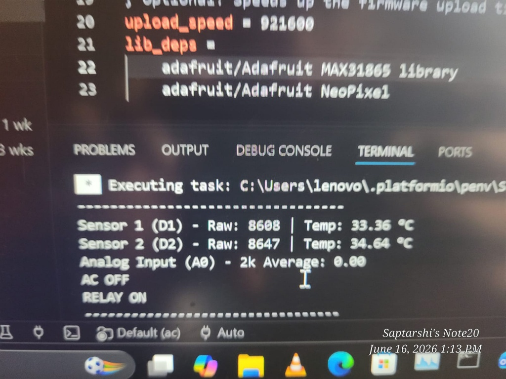
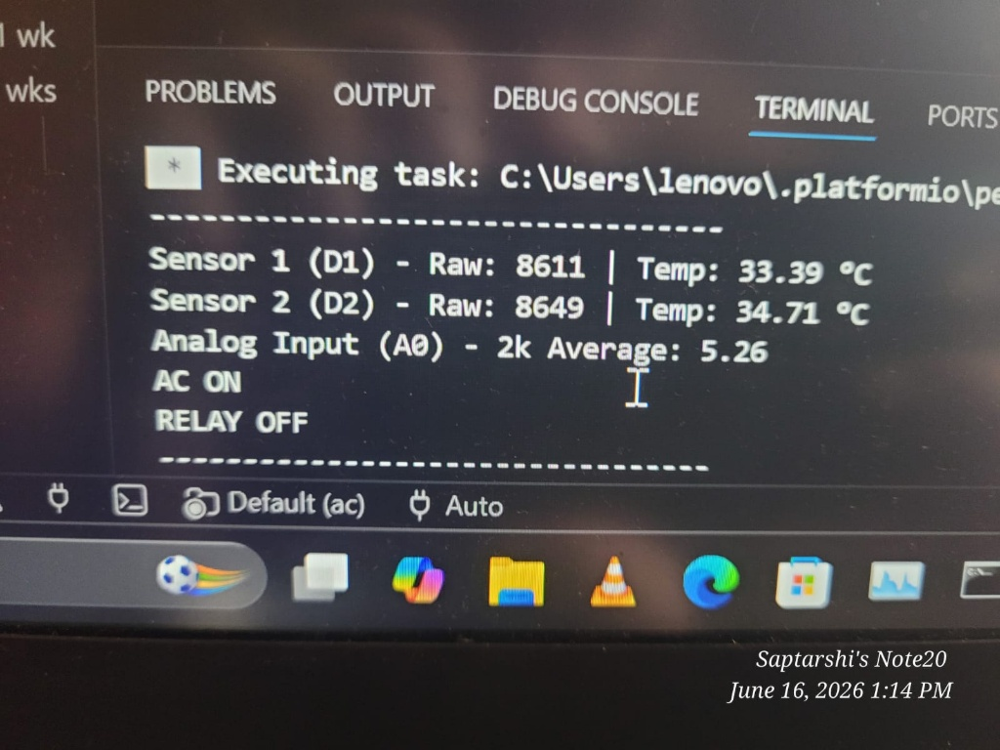
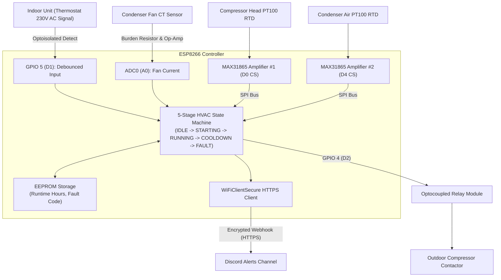

# ESP8266 Smart HVAC Compressor Protection & IoT Telemetry System

An industrial-grade HVAC compressor protection and telemetry controller utilizing an ESP8266, dual MAX31865 PT100 RTD amplifiers, current transformer monitoring, anti-short-cycle state machine, and HTTPS Discord webhook alerting.


---

## Overview

The Smart AC Control System is an embedded equipment-protection controller designed to intercept and evaluate indoor thermostat commands before activating high-power outdoor HVAC compressors. Outdoor air conditioning compressors are vulnerable to catastrophic thermal burnouts caused by condenser fan failure, low refrigerant pressure, or rapid on/off short-cycling. This controller runs a non-blocking 5-stage Finite State Machine (FSM) that monitors compressor head and condenser fan temperatures via dual MAX31865 SPI RTD amplifiers, samples fan current via a current transformer on the analog input, and enforces a mandatory 3-minute anti-short-cycle delay. When operating parameters are safe, the system energizes the compressor contactor relay; upon anomaly detection, it triggers an immediate emergency shutdown, logs the fault code to onboard EEPROM, and dispatches detailed alarm embeds via Discord webhooks.

<p align="center">
  
  <br>
  <em><strong>Figure 1:</strong> Physical controller hardware mounted inside protective electrical junction enclosure, featuring microcontroller board, dual Adafruit MAX31865 RTD PT100 temperature amplifier breakouts, optoisolated compressor contactor relay module, and dedicated AC-DC power converter.</em>
</p>

---

## Features

- **5-State Non-Blocking Finite State Machine:** Structured state transitions across `IDLE`, `STARTING`, `RUNNING`, `COOLDOWN`, and `FAULT` without `delay()` calls blocking sensor or network workers.
- **Precision Dual RTD Thermal Monitoring:** Dual Adafruit MAX31865 SPI amplifiers reading PT100 Platinum RTDs ($R_{\text{ref}} = 430\,\Omega$, $R_0 = 100\,\Omega$) for compressor head ($T_{\text{comp}} < 200^{\circ}\text{C}$) and condenser exhaust fan.
- **Hardware Compressor Safeguards:**
  - **Anti-Short-Cycle Lockout:** 3-minute (180s) mandatory delay between cycles prevents compressor motor burnout against unequalized head pressures.
  - **Startup Stabilization Gate:** 30-second post-start validation window verifies fan current generation before locking into running mode.
  - **Fan Loss-of-Flow Interlock:** Detects broken fan belts or locked rotors using an analog Current Transformer ($I_{\text{fan}} < 200$ ADC count trip).
- **Non-Volatile Equipment History:** On-chip EEPROM records lifetime cumulative compressor run hours and stores the most recent fault trip code across power cycles.
- **Instant Out-of-Band Cloud Alerting:** Emits encrypted HTTPS Discord webhook embeds containing temperature readings, run duration, and timestamped fault reasons.
- **Network Time & Resilient Reconnection:** NTP synchronization with IST timezone management and an exponential backoff Wi-Fi reconnection supervisor.

---


## Live Firmware Telemetry & State Transitions

<p align="center">
  
  &nbsp;
  
</p>
<p align="center">
  <em><strong>Real-Time PlatformIO Serial Monitor Telemetry:</strong>
  <br>
  <strong>Left (Standby / Call for Cool):</strong> Dual MAX31865 RTD temperature telemetry (Sensor 1 at 33.36°C, Sensor 2 at 34.64°C) with analog current feedback zeroed (0.00) while AC is in standby (<code>AC OFF</code>, <code>RELAY ON</code>).
  <br>
  <strong>Right (Active Cooling Cycle):</strong> Real-time transition to active refrigeration (<code>AC ON</code>, <code>RELAY OFF</code>) with 2,000-sample averaged analog current detection (5.26 count average) confirming compressor load under safe thermal thresholds.</em>
</p>

---

## Hardware Architecture & Pin Mapping

### Components
- **Microcontroller:** NodeMCU v2 (Espressif ESP8266 @ 80 MHz / 160 MHz)
- **Thermal Sensors:** 2x PT100 3-wire/4-wire Platinum RTD probes with Adafruit MAX31865 SPI breakout boards
- **AC Current Sensor:** Current Transformer (CT) coil with burden resistor and operational amplifier signal conditioning
- **AC Signal Intercept:** Optoisolated 230V AC zero-crossing voltage sensor reading indoor thermostat command
- **Actuator:** 5V / 12V SPDT optocoupled Relay Module switching HVAC 24V/230V contactor coil

### Pin Mapping Table

| Peripheral | Function / Signal | ESP8266 Pin | NodeMCU Pin | Description |
|---|---|---|---|---|
| **Compressor MAX31865** | Chip Select (`SENSOR1_CS`) | **GPIO 16** | **D0** | SPI Device Select for Compressor RTD |
| **Condenser Fan MAX31865**| Chip Select (`SENSOR2_CS`) | **GPIO 2** | **D4** | SPI Device Select for Fan RTD |
| **MAX31865 SPI Bus** | SPI Clock (SCK) | **GPIO 14** | **D5** | Hardware SPI Serial Clock |
| **MAX31865 SPI Bus** | SPI MISO | **GPIO 12** | **D6** | Hardware SPI Master In Slave Out |
| **MAX31865 SPI Bus** | SPI MOSI | **GPIO 13** | **D7** | Hardware SPI Master Out Slave In |
| **AC Control Signal** | Call for Cool (`AC_SENSOR`)| **GPIO 5** | **D1** | Optoisolated thermostat digital input |
| **Compressor Relay** | Contactor Control (`RELAY`) | **GPIO 4** | **D2** | Active High/Low relay driver output |
| **Fan Current Sensor** | Analog CT Signal (`A0`) | **A0 (ADC0)**| **A0** | 0-1.0V AC current transformer sense |
| **System Power** | 5V / VIN & GND | 5V / GND | VIN / GND | Regulated DC power bus |

---

## Block Diagram



---

## State Machine Overview

```
 [IDLE] --(Thermostat Call ON & Cooldown Expired)--> [STARTING]
   |                                                     |
   |                                         (Fan Current Verified in 30s)
   |                                                     v
   |<--(Thermostat Call OFF)------------------------ [RUNNING]
   |                                                     |
   v                                           (Overheat / Fan Fail)
 [COOLDOWN] (Anti-Short-Cycle: 3 min) <------------------+
   ^                                                     |
   |                                                     v
   +------------------(Fault Acknowledged)---------- [FAULT]
```

---

## Software & Tools

- **Framework:** Arduino Framework on PlatformIO Core
- **Target Platform:** `espressif8266` (`board = nodemcuv2`, 115200 baud)
- **Key Libraries:**
  - `Adafruit MAX31865 library` — SPI RTD communication & fault diagnosis
  - `ESP8266WiFi` & `ESP8266HTTPClient` — Wi-Fi stack & HTTPS webhooks
  - `WiFiClientSecure` — TLS transport for webhook endpoints
  - `EEPROM` — Non-volatile storage management

---

## Project Structure

```
Smart_ac_control_system/
├── .vscode/
│   └── extensions.json       # Recommended VS Code extensions
├── include/
│   └── README                # Include headers guidance
├── lib/
│   └── README                # Private project libraries
├── src/
│   └── main.cpp              # Complete FSM firmware and drivers
├── test/
│   └── README                # Unit testing directory
├── platformio.ini            # PlatformIO build settings & dependencies
└── README.md                 # System architecture documentation
```

---

## Setup and Usage

### Prerequisites
- Install [PlatformIO Core](https://platformio.org/install/cli) or VS Code PlatformIO extension.
- Connect your NodeMCU board via USB.

### Build and Upload
```bash
# Clone the repository
git clone https://github.com/saptarshidas578/Smart_ac_control_system.git
cd Smart_ac_control_system

# Build project
pio run -e nodemcuv2

# Upload to NodeMCU
pio run -e nodemcuv2 -t upload

# Monitor Serial Output
pio run -e nodemcuv2 -t monitor -b 115200
```

### Configuration Notes
*Configure local Wi-Fi and webhook target in `src/main.cpp`:*
```cpp
const char* WIFI_SSID = "YOUR_WIFI_SSID";
const char* WIFI_PASSWORD = "YOUR_WIFI_PASSWORD";
const char* discordWebhookURL = "YOUR_DISCORD_WEBHOOK_URL";
```

---

## Future Work

- [ ] MQTT telemetry integration with Home Assistant or Grafana.
- [ ] Support for ambient temperature compensation in trip thresholds.
- [ ] Local OLED status screen option for field diagnostics.

---

## Author & Contact

- **Author:** [saptarshi2007 (saptarshidas578)](https://github.com/saptarshidas578)
- **Institution:** B.Tech Electrical & Computer Science Engineering, VIT Vellore
- **LinkedIn:** https://www.linkedin.com/in/saptarshi-das-3255673a1/

---

## License

[MIT License](https://opensource.org/licenses/MIT).  

