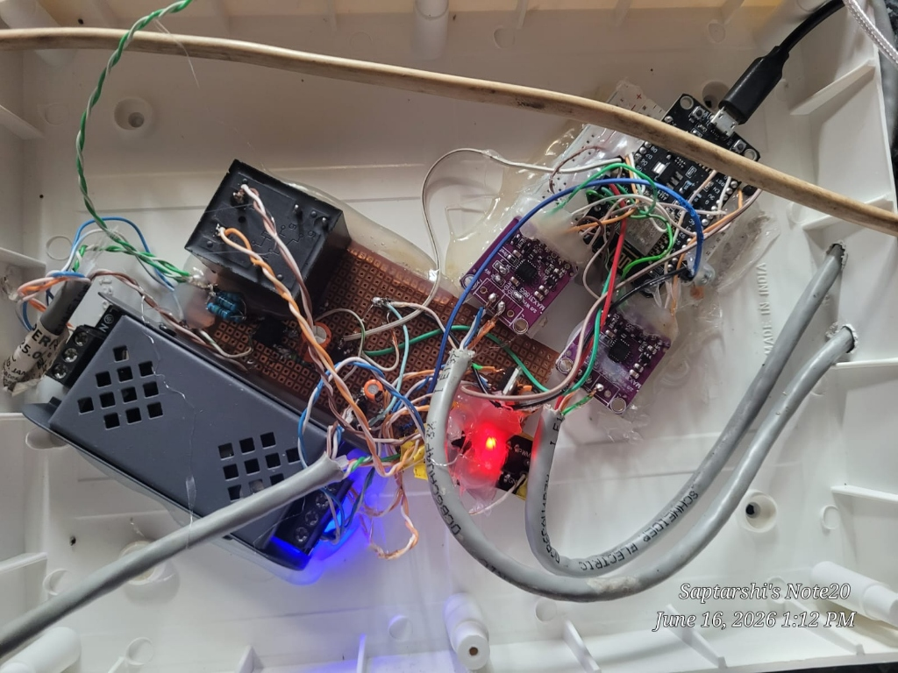

# Sensor Wiring & SPI Pinout Guide

## NodeMCU v2 (ESP8266) Pin Allocation

| Module | Signal Name | NodeMCU Pin | ESP8266 GPIO | Description |
|---|---|---|---|---|
| **Compressor RTD (MAX31865 #1)** | SENSOR1_CS | **D0** | **GPIO 16** | Active Low SPI Chip Select |
| **Condenser Fan RTD (MAX31865 #2)**| SENSOR2_CS | **D4** | **GPIO 2**  | Active Low SPI Chip Select |
| **Shared MAX31865 SPI Bus** | SCK | **D5** | **GPIO 14** | Hardware SPI Clock |
| **Shared MAX31865 SPI Bus** | MISO | **D6** | **GPIO 12** | Hardware SPI Master-In-Slave-Out |
| **Shared MAX31865 SPI Bus** | MOSI | **D7** | **GPIO 13** | Hardware SPI Master-Out-Slave-In |
| **AC Call Signal (Optocoupler)** | AC_SENSOR | **D1** | **GPIO 5**  | Debounced 230V AC thermostat input |
| **Compressor Contactor Relay** | RELAY_OUTPUT | **D2** | **GPIO 4**  | Active High/Low relay coil driver |
| **Condenser Fan CT Sensor** | Current Sense | **A0** | **ADC0**    | 0-1.0V conditioned analog AC signal |

## Hardware Prototype & Enclosure Assembly

  
   
  <em>Figure: Physical layout inside wall-mount junction box showing optoisolated relay stage (left), dual MAX31865 RTD boards (center), and microcontroller interface (right).</em>

